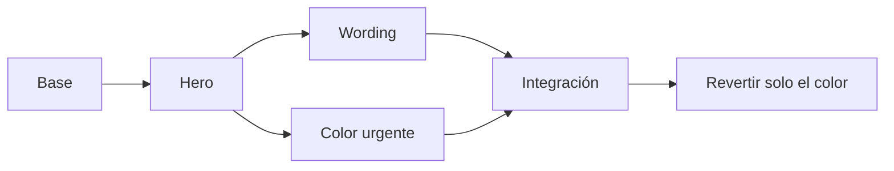

# Una landing, cinco imprevistos

Una partida, un repositorio y una timeline que crece. Los mensajes son situaciones ficticias de trabajo, no resultados de un A/B test real.

| Capítulo | Situación | Acciones del jugador | Lo que queda en Git |
| --- | --- | --- | --- |
| 1. v1_final_ahora_sí | La IA propone dos heroes | Elegir, add, commit | El hero guardado en main |
| 2. ¿Y si probamos otro wording? | Growth quiere probar un CTA sin tocar main | branch, checkout, elegir, add, commit | experimento-wording tiene un commit propio, main queda en el hero |
| 3. Viernes, 18:57 | El stakeholder pide un botón urgente para la demo | checkout main, elegir rojo/naranja, add, commit | main avanza en paralelo, la rama de wording se conserva |
| 4. El experimento gustó | El equipo aprueba el wording | merge experimento-wording | Un commit con dos padres, texto nuevo y color urgente |
| 5. Era para la otra landing | El pedido del color era para otro proyecto | revert del commit de color | Nueva corrección, color original, wording conservado, historial intacto |

Las flechas de este esquema siguen el tiempo. En el canvas original, los enlaces representan relaciones entre los commits y sus padres.

## Reglas del recorrido

- Las dos opciones de hero, wording y color afectan realmente la preview y los archivos.
- Crear una rama no cambia HEAD. Checkout sí cambia la rama activa y los archivos visibles.
- El primer cambio vive en HTML y el segundo en CSS. El merge de este caso no tiene conflictos.
- El siguiente capítulo se habilita al comprobar contenido, rama, parentesco e índice limpios. No basta con haber pulsado un botón o usado un nombre de comando.
- El revert acepta solo el commit de color indicado. El hash puede escribirse completo o abreviado a al menos siete caracteres.
- Las referencias internas y los intentos descartados al empezar otra historia no aparecen en el canvas.
- Se puede consultar status, log, diff, show y branch. El resto de los comandos está acotado al paso activo para que un error no deje el recorrido sin salida.

## Validación

`npm test` comprueba Git, migración desde la primera versión, guardado a mitad de rama, elecciones alternativas, orden inválido, concurrencia, fallas de persistencia y reinicio. El repositorio exportado pasa `git fsck` y el árbol final del revert se compara con `git revert` nativo.

`npm run test:browser` juega los cinco capítulos con mouse y teclado en Chromium, comprueba audio, arrastre de cartas y nodos, bifurcación, merge, rechazos, persistencia y reinicio. Los snapshots solo se usan para observar estado y localizar elementos, no para resolver las acciones del juego.

No se validó Safari, Firefox ni interacción táctil.
